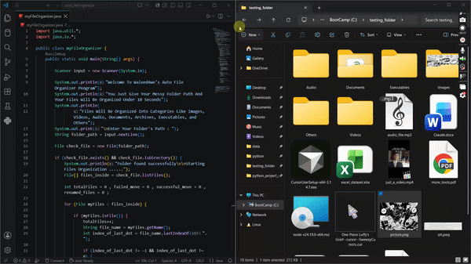
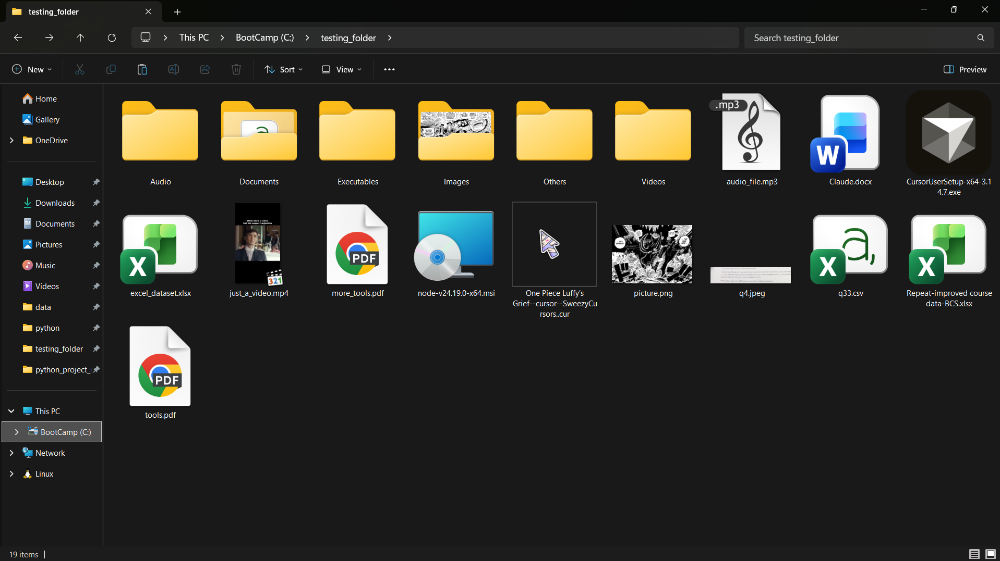
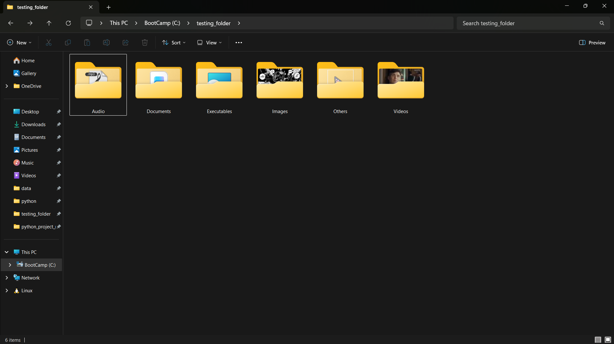

<div align="center">

<h1> Java Auto File Organizer </h1>

   

</div>

---

## 📌 About The Project

**Java Auto File Organizer** is a Java-based console application designed to organize files inside a messy folder automatically
The user simply provides the path of a folder, and the program scans its files, identifies their extensions, creates appropriate category folders, and moves the files into their respective categories





---

## ✨ Features

- 📂 Accepts a folder path from the user
- 📁 After Proper Validation , Automatically creates category folders
- 🖼️ Organizes Images, Audios, Documents, Archive And Executable Files
- 📦 Places unsupported file types into `Others`
- 🔄 Handles duplicate filenames automatically
- 🔢 Renames duplicates using `(1)`, `(2)`, `(3)` etc.
- ✅ Tracks successfully moved files
- ❌ Tracks failed file movements
- 📊 Displays a final summary after organization

---

## 🗂️ File Categories

| Category       | Supported Extensions                                                      |
| -------------- | ------------------------------------------------------------------------- |
| 🖼️ Images     | `.jpg`, `.png`, `.webp`, `.jpeg`, `.gif`, `.svg`                          |
| 🎬 Videos      | `.mp4`, `.mkv`, `.avi`, `.mov`, `.webm`                                   |
| 🎵 Audio       | `.mp3`, `.wav`, `.flac`, `.aac`, `.m4a`, `.ogg`                           |
| 📄 Documents   | `.pdf`, `.docx`, `.txt`, `.doc`, `.ppt`, `.pptx`, `.xls`, `.xlsx`, `.csv` |
| 🗜️ Archives   | `.zip`, `.rar`, `.7z`, `.tar`, `.gz`, `.iso`                              |
| ⚙️ Executables | `.exe`, `.msi`, `.apk`, `.jar`                                            |
| 📦 Others      | All Other File Extensions                                                 |

---

## 🖼️ Before & After


### Before — Messy Folder



### After — Organized Folder


---

## 🔄 Duplicate File Handling

The program prevents existing files from being overwritten.

For example, if `photo.jpg` already exists inside the `Images` folder, the new file will automatically be renamed:

```text
photo.jpg
photo (1).jpg
photo (2).jpg
photo (3).jpg
```

This ensures that existing files remain safe while the new file is still moved successfully.

---

## ⚙️ How It Works

```
User enters folder path
          ↓
Check if folder exists
          ↓
Scan files inside folder
          ↓
Read file extension
          ↓
Identify file category
          ↓
Create category folder
          ↓
Check for duplicate filename
          ↓
Generate unique filename if required
          ↓
Move file
          ↓
Display final summary
```

---

## 📊 Final Summary

After the organization process is completed, the application displays a simple summary:

```
Total Files Found : 20
Successfully Moved Files : 18
Failed To Move Files : 2
Renamed Files : 3
```

This allows the user to quickly understand what happened during the organization process.

## 🛠️ Technologies & Concepts

### Language : Java
### Java APIs

1. `java.util.Scanner`
2. `java.io.File`

### Concepts Used

1. File & Directory Handling
2. String Manipulation
3. File Extension Detection
4. Switch Expressions
5. Loops
6. Conditional Statements
7. File Renaming And Mpving
8. Duplicate File Handling
9. Console Input / Output

---

## 🚀 Getting Started

Make sure Java is installed on your system.
### 1️⃣ Clone the Repository

```
git clone https://github.com/waleed4we/auto-file-organizer.git
cd auto-file-organizer

javac myFileOrganizer.java

java myFileOrganizer
```

### 2️⃣ Open the Project In Any IDE

Open the project in any Java-supported IDE, such as:
- IntelliJ IDEA
- VS Code
- Eclipse

### 3️⃣ Compile the Program

```
javac myFileOrganizer.java
```

### 4️⃣ Run the Program

```
java myFileOrganizer
```

### 5️⃣ Enter Your Folder Path

When the program asks for a folder path, enter the folder you want to organize.

Example:

```
C:\Users\YourName\Downloads
```

The application will then automatically organize the files.

---

## 📁 Project Structure

```
Java-Auto-File-Organizer/
│
├── myFileOrganizer.java
│
├── images/
│   ├── before.png
│   └── after.png
│
├── demo/
│   └── demo_video.mp4
│
└── README.md
```

---

## ⚠️ Important Note

This application **moves files from their original location** into category folders.

Make sure you provide the correct folder path and keep backups of important files before running the program on important data.

---

## 👨‍💻 Author

**Malik Waleed Hussain**

**Data Analytics / Coder / Computer Science Student**

GitHub: **@waleed4we**
