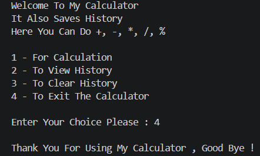
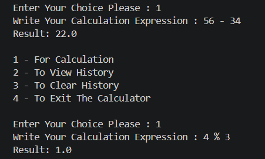
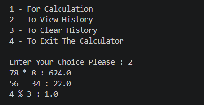
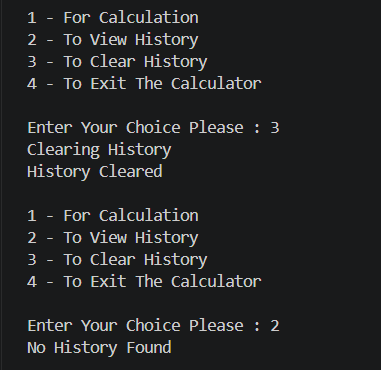

# 🧮 History Saving Calculator In Java

<p align="center">
  
</p>

<p align="center">
  
  
  
</p>

<p align="center"><i>A Java console calculator that performs basic arithmetic and automatically saves every successful calculation to a local history file.</i></p>

---

## 📑 Table of Contents

- [Features](#-features)
- [Technologies & Concepts Used](#️-technologies--concepts-used)
- [Screenshots](#-screenshots)
- [Project Structure](#-project-structure)
- [How To Run](#️-how-to-run)
- [How It Works](#-how-it-works)
- [History System](#-history-system)
- [Input Handling](#️-input-handling)
- [Project Purpose](#-project-purpose)
- [Author](#-author)

---

## 🚀 Features

- ➕➖✖️➗ Performs basic arithmetic Operations : `+`, `-`, `*`, `/`, `%`
- 💾 Saves every successful calculation to history
- 📜 View saved calculation history
- 🧹 Clear calculation history
- 🛡️ Handles invalid numbers, invalid operators, and division by zero
- 🛡️ Also handles modulo by zero and invalid menu input
- ℹ️ Displays a message when no history is found

---

## 🛠️ Technologies & Concepts Used

<div align="center">

| Category | Details |
|:---:|:---|
| ☕ Language | Java (Console Application) |
| 🔀 Control Flow | `if-else` · `switch` · `while` loops |
| 🧩 Structures | Methods · Arrays · Strings |
| ⌨️ Input | `Scanner` |
| 📁 File Handling | `BufferedReader` · `BufferedWriter` |
| 🛡️ Robustness | Exception Handling |

</div>

---

## 📸 Screenshots

<table align="center">
<tr>
<th>Calculator Menu</th>
<th>Performing A Calculation</th>
</tr>
<tr>
<td></td>
<td></td>
</tr>
<tr>
<th>Viewing Calculation History</th>
<th>Clearing Calculation History</th>
</tr>
<tr>
<td></td>
<td></td>
</tr>
</table>

---

## 📂 Project Structure

```text
history_saving_calculator/
│
├── screenshots/
│   ├── clearing_history.png
│   ├── menu_and_exit.png
│   ├── performing_a_calculation.png
│   └── viewing_history.png
│
├── java_calculator.java
└── readme.md
```

> [!NOTE]
> `history.txt` is created automatically by the program and is intentionally **not included** in the repository, since it contains personal calculation history.

---

## ▶️ How To Run

### 1️⃣ Clone the Repository

```bash
git clone YOUR_REPOSITORY_URL
```

### 2️⃣ Open the Project

Open the `history_saving_calculator` folder in your Java IDE or VS Code.

### 3️⃣ Compile the Program

```bash
javac java_calculator.java
```

### 4️⃣ Run the Program

```bash
java java_calculator
```

---

## 🧮 How It Works

When the program starts, you can choose from four options:

```
1 → Perform A Calculation
2 → View Calculation History
3 → Clear Calculation History
4 → Exit The Calculator
```

For calculations, enter an expression using spaces between the numbers and the operator — for example:

```
10 + 5
```

<details>
<summary><b>🔍 Click to see the full parsing & calculation walkthrough</b></summary>
<br>

The calculator takes the complete expression as a **String** using `Scanner`, and stores it in the `user_choice` variable:

```
10 + 5
```

The program then trims extra spaces and splits the expression on a space:

```java
String[] parts = user_choice.trim().split(" ");
```

This splits `10 + 5` into three parts:

```
parts[0] → 10
parts[1] → +
parts[2] → 5
```

representing:

- `parts[0]` → First number
- `parts[1]` → Operator
- `parts[2]` → Second number

The program first checks that the expression contains exactly three parts — if the format is invalid, the user is asked to re-enter it. The first and second parts are then converted from `String` to `double` using `Double.parseDouble()`. The operator stays a `String` and is used in a `switch` statement to determine which operation runs:

```
+ → Addition
- → Subtraction
* → Multiplication
/ → Division
% → Modulo
```

For `10 + 5`, the program computes `15.0` and displays:

```
Result: 15.0
```

Successful calculations are automatically saved to `history.txt`.

</details>

---

## 📜 History System

The calculator uses Java file handling to store calculation history. Each successful calculation is saved in this format:

```text
10 + 5 : 15.0
20 * 3 : 60.0
100 / 4 : 25.0
```

The history can be:

- 👀 Viewed
- ➕ Appended with new calculations
- 🧹 Cleared completely

---

## ⚠️ Input Handling

The program handles common invalid inputs such as:

- Invalid menu choices
- Invalid numbers
- Invalid operators
- Division by zero
- Modulo by zero
- Empty history

---

## 🎯 Project Purpose

This mini project was built to practice core Java concepts, including:

- Variables · Conditional statements · Loops
- Switch statements · Methods · Arrays · Strings
- Exception handling
- File reading and writing
- User input handling

---

## 👨‍💻 Author

**Malik Waleed Hussain**
*Data Analytics / Coder / Computer Science Student*
GitHub: [**@waleed4we**](https://github.com/waleed4we)

---

<p align="center"><i>A beginner-level Java project built as part of my Java Mini Projects collection.</i></p>
